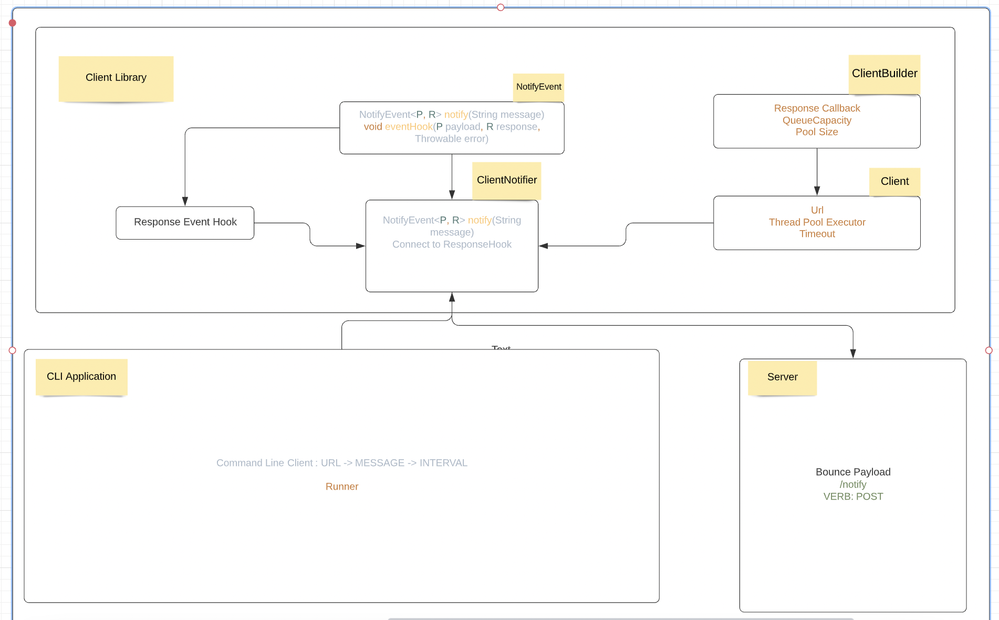
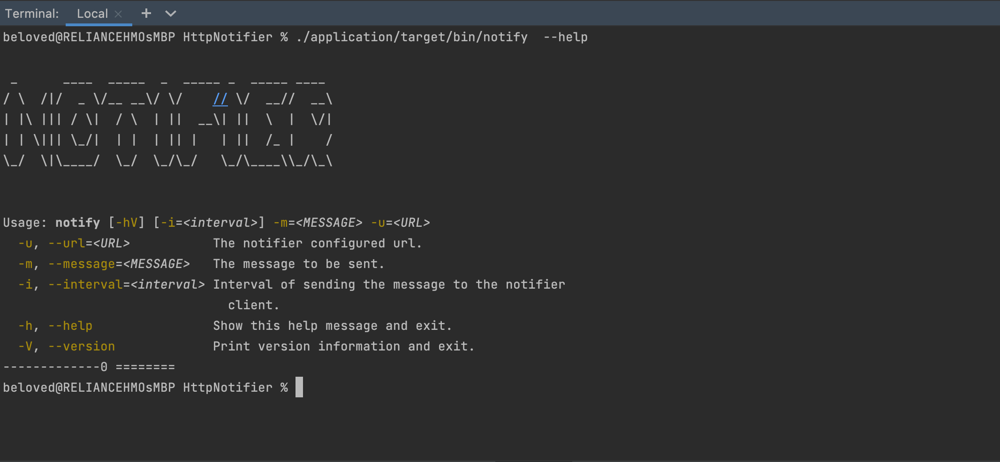
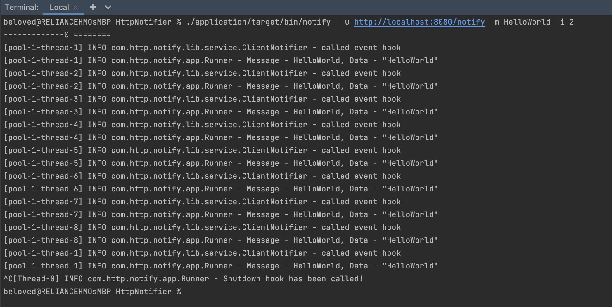

# HttpNotifier
## Quick Run
#### Note: You must have JDK14+ on your system to run this project on local
- ./mvnw package (Package whole project)
- ./server/mvnw spring-boot:run (Run server using spring plugin)
- ./application/target/bin/notify  -u http://localhost:8080/notify -m HelloWorld -i 2 (trigger script pass builld)


### Client Architecture
[](assets/client-architecture.png)

### Resources
##### CLI HELP
[](assets/cli-help.png)
##### CLI RUN
[](assets/cli-run.png)

# DEEP DIVE
HttpNotifier is divided into 3 main modules
* library
- application
- server

#### Library
* This is the core module of the whole application, it features
* A client (with it's builder -> Builder Pattern)
* ThreadPoolExecutor Mechanism to control message spike, threads in pool and thread Queuing
* ClientNotifier handles sending events to the server using an executor and running response hook upon message delivery
* Error Handling was implemented using Response Hook and GenericResponse class that handles success or failure of server sent events

##### Client
- The client stores information about the event process (timeout, url) and also create executor for sending events
- a client can only be created from a client builder which takes in url and a responseCallback as compulsory parameters,
- then we can have adjusted thread pool setting the queue size, max pool size and the connectorTimeout

#### Thread
* ThreadPoolExecutor - ClientExecutor
* ClientExecutor handles initialization of threadpool executor, setting the defaults for handling spike and spawning threads
  based on policy, it also handles running a notify trigger for the ClientNotifier class
* ClientExecutor comes with the default settings
- corePoolSize=8
- maxPoolSize=16
- queueCapacity=200
- This implies that we can have only 8 threads running when several 'notify events' are triggered, while maintaining a pool size
  of 18 different pool (in this regard pool refer to client since each pool is tightly created at the point of creating the executor),
  also if all the threads are currently occupied, the callable tasks/events will be queued up and can ONLY have 200 capacity,
  if the queue capacity is exhausted, then a throwable error will be propagated.
#### Client Notifier
The notifier implements NotifyEvent which has
```java
//P payload
//R response
public interface NotifyEvent<P, R> {
    NotifyEvent<P, R> notify(String message);
    void eventHook(P payload, R response, Throwable error);
}
```
- The client notifier gets a client object that contains a configured url, and callback and other tuned settings,
  then apply the
  url to the configured server, make a request by implementing the notify method which uses the threadPoolExecutor and get back the
  response in form of HttpResponse<String>.
  The response gotten is used to trigger a response callback/hook supplied by the client, this is represented as
```java
class T{
    private final BiConsumer<GenericResponse<String>, GenericResponse<Throwable>> responseCallback;
}
```
if the message was successfully sent, then a genericResponse with the message payload will be populated but if otherwise
a throwable object of genericResponse will be supplied and will be acted on
### ErrorHandling
Error is handled in the callback hook supplied, and it's always in form of GenericResponse<Throwable>, the GenericResponse object
will contain the passed message, the time (epoch time milliseconds) the error occurred and the throwable error data

## Application
* ClientApplication covers the cli used (picocli) in interfacing with the user, we have 2 mandatory fields
* Url -u --url : This configure the url for the server
* Message -m --message: the message payload
  The other options are not compulsory
  --interval -i specify the interval the message will be sent to the client library, if it's not specified, then the payload
  is sent once
* Version (0.0.1) and help
#### Runner
When the run method is called, the runner is instantiated and default client settings are used to call the client notifier
which will in turn send messages as events
* The runner implements shutdownHook (SIGINT) which will destroy the ThreadPoolExecutor used in spawning and queuing threads

## Server
The server is a standalone module that deals with incoming messages. It does a rebound by geting a POST message and returning the same value
it can be accessed by sending a POST request with message payload to url http://localhost:8080/notify

Technology used
JAVA
SPINGBOOT
SLFJ Logger
JUnit -> for tests
## License

MIT

**Free Software!**


